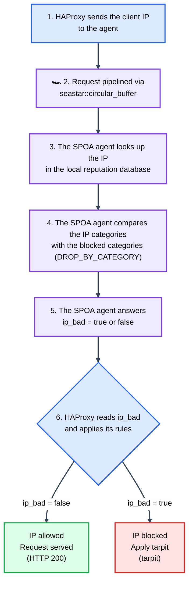
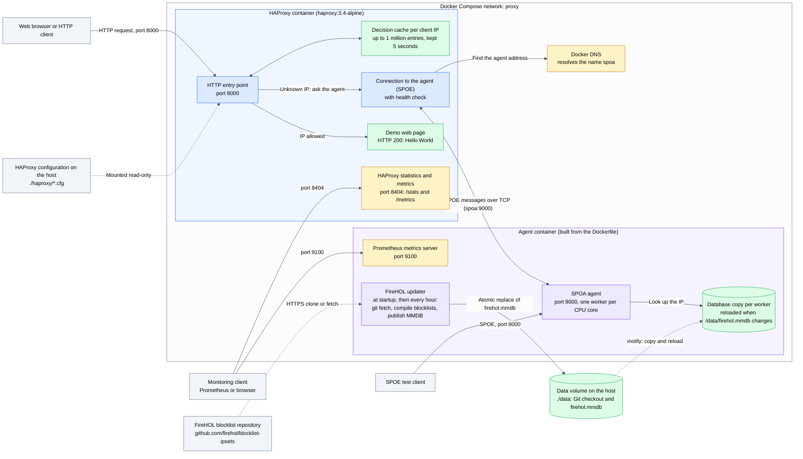
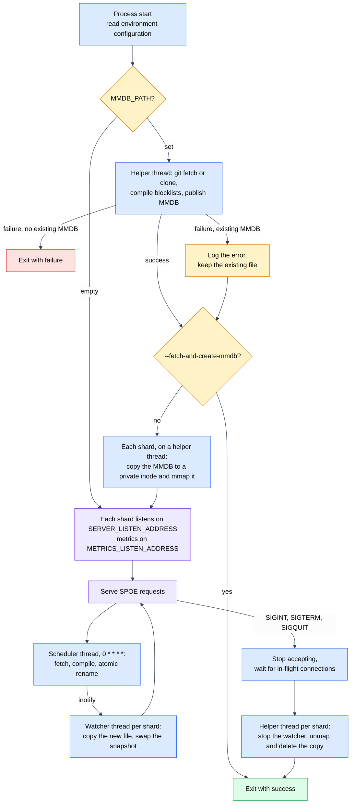
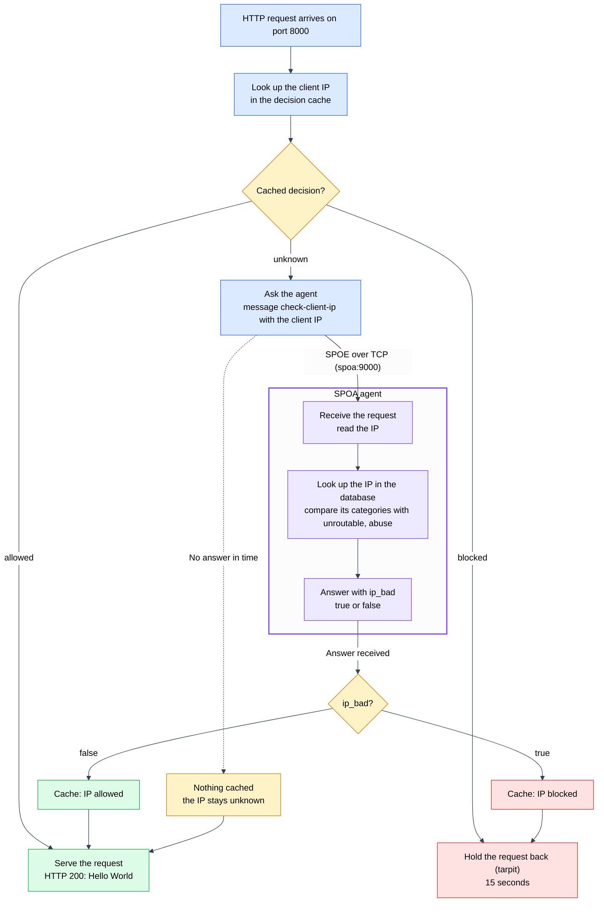
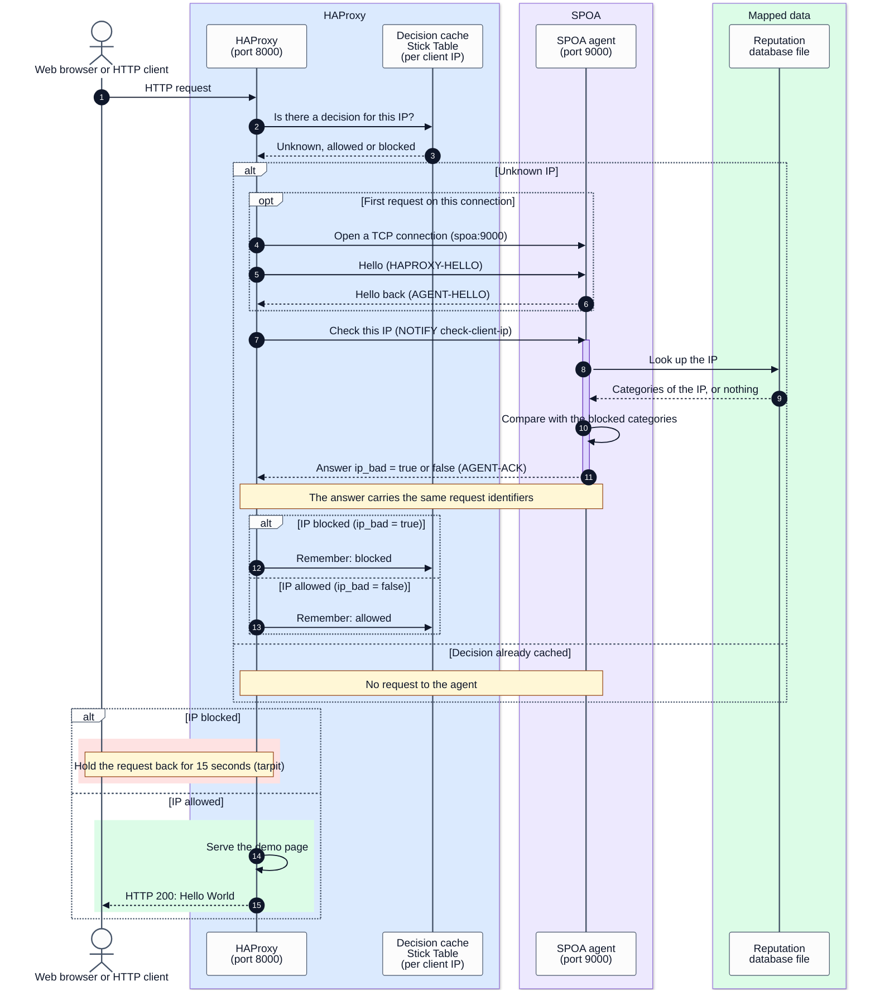
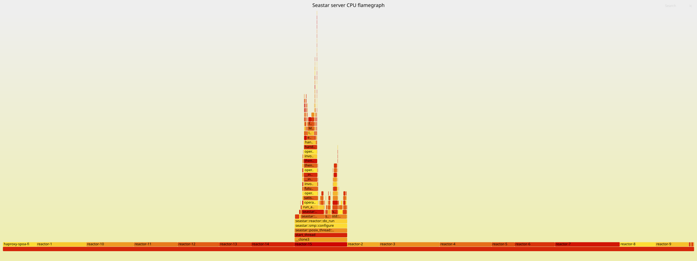

# haproxy-spoa-firehol-mmdb

A C++20 SPOA agent for HAProxy. It looks up client IPs in a MaxMind DB (MMDB) reputation database and returns to HaProxy a boolean `ip_bad` decision. Built on Seastar, it runs one worker per CPU core.

## Table of contents

- [✨ Features](#features)
- [🔎 How it works](#how-it-works)
- [🏗️ Architecture](#architecture)
- [🔁 Request sequence](#request-sequence)
- [🐳 Getting started with Docker Compose](#getting-started-with-docker-compose)
- [⚙️ Agent configuration](#agent-configuration)
- [🔄 MMDB reloads and memory management](#mmdb-reloads-and-memory-management)
- [📊 Metrics](#metrics)
- [🔧 Building and testing](#building-and-testing)
- [🏁 Bench](#bench)
- [📁 Code layout](#code-layout)

## ✨ Features

- 🌐 **IPv4, IPv6 & string addresses** — Native full-spectrum IP support.
- 🛡️ **Category-based decisions** — MMDB categories dynamically matched against a blocklist (e.g., `unroutable,abuse`), using datasets like [FireHOL](https://github.com/firehol/blocklist-ipsets/).
- 🏎️ **Ring Buffer Pipelining** — High-performance request pipelining using `seastar::circular_buffer` to decouple IO and processing, maximizing throughput.
- ⚡ **Seastar Sharding** — One Seastar shard per CPU core; each runs its own listener, request processor, and database for lock-free scaling.
- 🪶 **Zero-Copy Architecture** — Copies completely avoided: parsing through `std::string_view`, categories read directly from mapped memory, and zero-allocation response buffers.
- 🔄 **Automatic Hot Reloads** — Inotify-driven MMDB reloads with atomic publication (automatically falls back to the previous snapshot on error).
- 📊 **Prometheus Metrics** — Built-in telemetry for IP lookups, connection errors, compile timings, and memory statistics.
- 🐳 **Docker Compose Ready** — Deploy HAProxy plus the agent instantly with built-in service discovery and proper health checks.
- ⏱️ **HAProxy Decision Caching** — Intelligent stick-table caching retains each IP decision for 5 seconds (You can increase it if you wish), offloading traffic bursts.
- 🏁 **SPOE Benchmarks & Flamegraphs** — Fully integrated load testing for throughput, SLA latency, DPDK performance, and CPU sampling.

## How it works



One match in a frame is enough to flag it; unsupported argument types trigger a disconnect. HAProxy enforces the decision: [haproxy/haproxy.cfg](haproxy/haproxy.cfg) caches it for 5 seconds and tarpits flagged IPs, while the demo backend returns `Hello World`. Without a database, selected categories or a match, the address is not flagged. Lookup errors are counted but never flag an address.

## Architecture

Colors: blue HAProxy, purple SPOA, green data and allowed decisions, red blocked decisions, amber monitoring or unknown states, gray external clients.

### Docker Compose deployment

Both services share the `proxy` network defined in [docker-compose.yml](docker-compose.yml). HAProxy reaches the agent through Docker DNS at `spoa:9000`.



The `web` backend is generated inside HAProxy, and no Prometheus server is deployed. HAProxy waits for the agent's TCP health check (`depends_on: condition: service_healthy`) and also runs `option spop-check`. `/metrics` and `/stats` are separate listeners that both bind port `8404` flow.

### Agent internals

Each Seastar shard owns a listener, a request processor and its own database
snapshot. Everything that blocks (Git, blocklist compilation, copying or
unmapping the database) runs on helper threads, never on a reactor.

```mermaid
%%{init: {"theme": "neutral", "themeVariables": {"darkMode": false, "background": "#ffffff", "fontFamily": "Arial, sans-serif", "fontSize": "16px", "primaryColor": "#eff6ff", "primaryTextColor": "#000000", "primaryBorderColor": "#475569", "secondaryColor": "#f1f5f9", "secondaryTextColor": "#000000", "tertiaryColor": "#fcfcfc", "tertiaryTextColor": "#000000", "textColor": "#000000", "lineColor": "#334155", "edgeLabelBackground": "#fcfcfc", "clusterBkg": "#fcfcfc", "clusterBorder": "#475569", "titleColor": "#000000", "actorBkg": "#fcfcfc", "actorBorder": "#475569", "actorTextColor": "#0f172a", "actorLineColor": "#475569", "signalColor": "#0f172a", "signalTextColor": "#0f172a", "labelBoxBkgColor": "#fcfcfc", "labelBoxBorderColor": "#475569", "labelTextColor": "#0f172a", "loopTextColor": "#0f172a", "noteBkgColor": "#fff7d6", "noteBorderColor": "#92400e", "noteTextColor": "#0f172a", "activationBkgColor": "#ddd6fe", "activationBorderColor": "#5b21b6", "sequenceNumberColor": "#fcfcfc", "nodeTextColor": "#000000"}, "themeCSS": "& { background-color: #ffffff !important; } .nodeLabel, .edgeLabel, .cluster-label, .nodeLabel *, .edgeLabel *, .cluster-label * { color: #000000 !important; } text, tspan { fill: #000000 !important; } .edgePath .path { filter: drop-shadow(1px 0 0 #ffffff) drop-shadow(-1px 0 0 #ffffff) drop-shadow(0 1px 0 #ffffff) drop-shadow(0 -1px 0 #ffffff); } .arrowheadPath { filter: drop-shadow(1px 0 0 #ffffff) drop-shadow(-1px 0 0 #ffffff) drop-shadow(0 1px 0 #ffffff) drop-shadow(0 -1px 0 #ffffff); transform: scale(2.0); transform-origin: 10px 5px; }"}}%%
flowchart LR
    subgraph reactors["Seastar reactors (one per CPU core)"]
        server["spoa/spoa_server<br/>listener, connections, frame transport"]
        ring["🏎️ seastar::circular_buffer<br/>request pipelining limit=128"]
        agentp["spoa/spoa_agent<br/>frame parsing, lookups, AGENT-ACK"]
        proto["spoa/frame, typed_data, varint<br/>zero-copy SPOE protocol"]
        cats["spoa/drop_categories<br/>DROP_BY_CATEGORY and counters"]
        snapshot[("mmdb/mmdb_reload<br/>atomic shared_ptr to the current Mmdb")]
        prometheus["metrics/*_metrics<br/>Prometheus telemetry"]
        server --> ring --> agentp --> proto
        agentp --> cats
        agentp -->|"lookup"| snapshot
        agentp -.-> prometheus
    end
    subgraph helpers["Helper threads (utils/blocking_task)"]
        opener["Open and close the snapshot<br/>copy to a private inode, mmap, munmap"]
        prepare["Initial FireHOL preparation<br/>before serving traffic"]
    end
    subgraph watchers["Watcher thread per shard"]
        inotify["mmdb/mmdb_reload::watch<br/>poll on inotify and a stop eventfd"]
    end
    subgraph scheduler["job_scheduler thread"]
        cron["Cron 0 * * * *<br/>one job at a time, never overlapping"]
        git["firehol_blocklist_ipsets/git_repository<br/>libgit2: clone or fetch, hard reset"]
        compiler["firehol_blocklist_ipsets/compiler<br/>parallel parsing, batched inserts"]
        builder["mmdb_builder<br/>trie, record pool, columnar deep merge"]
        cron --> git --> compiler --> builder
        compiler -.-> prometheus
    end
    mmdbfile[("MMDB_PATH<br/>temporary file then atomic rename")]
    checkout[("FIREHOL_GIT_PATH<br/>blocklist checkout")]
    github["FIREHOL_GIT_REPO_URL"]

    github -.->|"HTTPS"| git
    git --> checkout --> compiler
    builder -->|"publish"| mmdbfile
    prepare -.->|"same steps once at startup"| git
    mmdbfile -.->|"IN_MOVED_TO"| inotify
    inotify -->|"copy and swap"| snapshot
    opener -->|"initial snapshot, teardown"| snapshot

    classDef processor fill:#ede9fe,stroke:#7c3aed,color:#000000
    classDef data fill:#dcfce7,stroke:#16a34a,color:#000000
    classDef control fill:#dbeafe,stroke:#2563eb,color:#000000
    classDef external fill:#f1f5f9,stroke:#64748b,color:#000000
    class server,agentp,proto,cats,ring processor
    class snapshot,mmdbfile,checkout data
    class opener,prepare,inotify,cron,git,compiler,builder control
    class github external
    style reactors fill:#f5f3ff,stroke:#7c3aed,color:#000000
    style helpers fill:#eff6ff,stroke:#2563eb,color:#000000
    style watchers fill:#eff6ff,stroke:#2563eb,color:#000000
    style scheduler fill:#eff6ff,stroke:#2563eb,color:#000000
```



### Startup, hourly update and shutdown



### HTTP request and IP reputation decision

Flow of [haproxy/haproxy.cfg](haproxy/haproxy.cfg) and the [SPOE configuration](haproxy/haproxy-spoa-ip-reputation-firehol.cfg). The stick-table stores `gpt0` per client IP: `0` unknown, `1` allowed, `2` blocked.



Cached entries skip the agent; unknown entries are queried again on the next request. SPOE timeouts: 2 s handshake, 30 s idle, 100 ms processing. A missing decision never blocks a request. The tarpit rule ends rule processing, so the later `silent-drop` rule is not reached.

### Request sequence

One successful lookup followed by requests served from the cache. The database participant is a local mapped copy inside the shard, and the SPOE handshake is reused for every request on a connection.



Cache entries expire after 5 seconds; the next request then takes the unknown-IP path again.

## Getting started with Docker Compose

Requirements: Docker Compose. The agent clones the FireHOL blocklists and generates `firehol.mmdb` itself at startup; entries hold a `category` array of strings. The project does not provide this database.

```sh
docker compose up --build -d
docker compose ps
docker compose logs -f spoa
```

Compose builds the agent, waits for its health check, then starts HAProxy.

| Host port | Service |
| --- | --- |
| `8000` | HAProxy demo HTTP frontend |
| `8404` | HAProxy `/metrics` and `/stats` |
| `9000` | Agent SPOE server |
| `9100` | Agent Prometheus metrics at `/metrics` |

```sh
curl http://localhost:8000/ # Haproxy
curl http://localhost:9100/metrics # Prometheus metrics
docker compose down
```

Deployment settings: [docker-compose.yml](docker-compose.yml). SPOE rules: [haproxy/haproxy-spoa-ip-reputation-firehol.cfg](haproxy/haproxy-spoa-ip-reputation-firehol.cfg).

## SPOA Agent configuration

| Environment variable | Default | Purpose |
| --- | --- | --- |
| `MMDB_PATH` | `firehol.mmdb` (relative to the working directory); empty: generation and lookups disabled | Output file for the generated MMDB, also opened by the agent |
| `FIREHOL_GIT_PATH` | `firehol-blocklist-ipsets` (relative to the working directory) | FireHOL Git checkout directory |
| `FIREHOL_GIT_REPO_URL` | `https://github.com/firehol/blocklist-ipsets` | Repository cloned or fetched before MMDB generation |
| `DROP_BY_CATEGORY` | Unset: nothing blocked | Comma-separated categories, whitespace ignored |
| `SERVER_LISTEN_ADDRESS` | `0.0.0.0:9000` | SPOE IPv4 address and port |
| `METRICS_LISTEN_ADDRESS` | `0.0.0.0:9100` | Metrics HTTP IPv4 address and port |
| `SSL_CERT_FILE` / `SSL_CERT_DIR` | System CA store (`/etc/ssl/certs`, `/etc/pki/tls/certs`) | CA certificates used to verify HTTPS Git remotes |

Compose mounts `./data` as `/data`, sets `MMDB_PATH=/data/firehol.mmdb`, `FIREHOL_GIT_PATH=/data/firehol-blocklist-ipsets` and `DROP_BY_CATEGORY=unroutable,abuse`; the checkout and the generated database persist on the host between restarts. Matching is exact and case-sensitive. Seastar options control shards and logging (`--help-seastar` lists them); each connection stays on one shard.

Unless `MMDB_PATH` is empty, startup first synchronizes the FireHOL checkout with
the remote `master` branch, then compiles its local blocklists into that file.
After this first attempt, a scheduler repeats the job at the beginning of each
hour (`0 * * * *`, local time). Each update runs directly in the scheduler's
dedicated thread so Git and MMDB generation do not block request processing.
Updates do not overlap; shutdown stops the scheduler and waits for an update
already in progress.

Seastar uses the system allocator so native threads can generate large MMDBs
and repeat updates without a fixed per-thread allocation pool. Its `--memory`
and `--reserve-memory` options do not limit process allocations in this build;
`--mbind` and `--abort-on-seastar-bad-alloc` are inactive. Seastar allocator
statistics do not reflect process memory usage, and heap profiling is
unavailable. Monitor and limit memory through the operating system or container.

Relative paths are resolved from the process working directory. The checkout
must be an empty directory for cloning or an existing clone with the configured
origin URL; an unrelated Git repository is rejected before fetch/reset.
By default the checkout is the `firehol-blocklist-ipsets` directory inside the
process working directory; set `FIREHOL_GIT_PATH` to use a dedicated checkout.

Each network record is columnar: every field is an array and index `i` of
each array describes the `i`-th blocklist containing the network, sorted by
`file_name`. Missing metadata is stored as an empty string so the columns stay
aligned. The agent matches `DROP_BY_CATEGORY` against the `category` array.

```sh
mmdbinspect -db firehol.mmdb -jsonl 172.30.5.1
{"record":{"category":["unroutable","attacks","unroutable"],
 "file_name":["cidr_report_bogons.netset","firehol_level1.netset","iblocklist_cidr_report_bogons.netset"],
 "list_source_url":["http://www.cidr-report.org/bogons/freespace-prefix.txt","","http://list.iblocklist.com/..."],
 "maintainer":["CIDR-Report.org","FireHOL","iBlocklist.com"],
 "maintainer_url":["http://www.cidr-report.org","http://iplists.firehol.org/","https://www.iblocklist.com/"],
 "source_file_date_rfc3339":["2024-12-05T04:05:43+00:00","2026-09-13T03:14:48+00:00","2024-12-06T11:02:03+00:00"]}}
```

Generation writes a temporary file beside `MMDB_PATH` and atomically replaces
the destination only on success. Mount the containing directory, rather than
the individual MMDB file, when generation runs in a container. If fetching or
compilation fails, the agent logs the error and uses an existing MMDB if one is
available; without a usable database, startup fails. An empty `MMDB_PATH`
keeps both generation and lookups disabled.

To run the same job once and exit, use `--fetch-and-create-mmdb`. This command
requires `MMDB_PATH`, does not start the scheduler, and returns a nonzero exit
code on failure:

```sh
FIREHOL_GIT_PATH=/var/lib/firehol/blocklists \
MMDB_PATH=/var/lib/firehol/firehol.mmdb \
./build/haproxy-spoa-firehol-mmdb --fetch-and-create-mmdb --smp 1
```

The agent uses the Linux TCP/IP stack (`posix`) by default. Templates are provided in [config/seastar.conf](config/seastar.conf) for networking and logging, and [config/io.conf](config/io.conf) for the `io_uring` reactor. Install them for the user running the agent:

```sh
mkdir -p ~/.config/seastar
cp -n config/seastar.conf config/io.conf ~/.config/seastar/
```

Seastar reads `~/.config/seastar/seastar.conf`, then `~/.config/seastar/io.conf`; command-line values take precedence. Without a reactor setting, Seastar selects an available backend. Override the template with `--reactor-backend=epoll` if `io_uring` is unavailable or restricted. Storage limits are left unset until measured for the target disk.

Use `--seastar-conf PATH` and `--io-conf PATH` to select other configuration files:

```sh
build/haproxy-spoa-firehol-mmdb --seastar-conf config/seastar.conf --io-conf config/io.conf
```

Each argument replaces only its corresponding default path. Missing default files are optional; an explicitly selected file must be readable and valid. Relative paths are resolved from the working directory, and command-line settings still take precedence over file settings.

DPDK is optional: use `--network-stack=native --dpdk-pmd` for a configured DPDK NIC, or `--dpdk-interface <interface>` to enable AF_PACKET mode, also available in the Docker benchmark. The latter selects the native stack and DPDK explicitly and uses ordinary memory without hugepages. This system-allocator build does not support DPDK with `--hugepages`. Configuration-file syntax for the presence flag is `dpdk-pmd=`; remove that line to disable it. The same applies to `poll-mode`: any `poll-mode=` line, including `poll-mode=0`, keeps every reactor thread at 100% CPU.

## MMDB reloads and memory management

The database directory is watched with `inotify`: attribute changes, closing after a write or renaming a file into place trigger a reload. Each load copies the file into a private temporary file and maps it. The snapshot is published atomically, readers keep the previous one until their lookup ends, and a failed load keeps the previous database. The copy protects readers from truncation at the cost of I/O and temporary storage per shard.

Compose mounts only the database file, so replacing it by rename on the host leaves the container on the old inode. For rename-based updates, mount the directory (`./data:/data:ro`) and store the database at `data/firehol.mmdb`.

Copies are avoided where possible: parsed strings and binaries are views into the receive buffer, categories are views into the mapped database, and the response buffer is handed to Seastar. The path is not end-to-end zero-copy: input fragments may be coalesced, responses are serialized, textual IPs need NUL termination and snapshots are copied.

## Metrics

Prometheus metrics are served at `http://localhost:9100/metrics`. Application counters are summed across shards, so they carry no `shard` label.

| Metric                                                | Type    | Labels                  | Meaning                                                                                                                                                                          |
|-------------------------------------------------------|---------|-------------------------|----------------------------------------------------------------------------------------------------------------------------------------------------------------------------------|
| `spoa_mmdb_lookups_total`                             | Counter | None                    | Lookups performed, including misses and errors; skipped arguments (database disabled) are excluded                                                                               |
| `spoa_mmdb_lookup_errors_total`                       | Counter | None                    | Lookups reporting an MMDB error; a missing entry is not an error                                                                                                                 |
| `spoa_mmdb_reloads_total`                             | Counter | None                    | Successful reloads, one per shard per update; initial loads and failures excluded                                                                                                |
| `spoa_firehol_blocked_total`                          | Counter | `categorie`             | Lookups matching a selected category, one series per category                                                                                                                    |
| `spoa_firehol_compile_runs_total`                     | Counter | None                    | MMDB compilations started, at startup and by the scheduler                                                                                                                       |
| `spoa_firehol_compile_failures_total`                 | Counter | None                    | Compilations that failed (invalid blocklist, worker thread exception, I/O error)                                                                                                 |
| `spoa_firehol_compile_in_progress`                    | Gauge   | None                    | 1 while an MMDB compilation runs, 0 when idle                                                                                                                                    |
| `spoa_firehol_compile_parse_seconds`                  | Gauge   | None                    | Blocklist parsing duration in seconds of the last successful compilation                                                                                                         |
| `spoa_firehol_compile_build_seconds`                  | Gauge   | None                    | MMDB trie construction and serialization duration in seconds of the last successful compilation                                                                                  |
| `spoa_firehol_compile_total_seconds`                  | Gauge   | None                    | Total end-to-end duration in seconds of the last successful compilation (parsing, building and file replacement)                                                                 |
| `spoa_firehol_compile_networks`                       | Gauge   | None                    | Total number of network entries inserted into the currently active MMDB                                                                                                          |
| `spoa_firehol_compile_blocklists`                     | Gauge   | None                    | Number of blocklist files (`.ipset` and `.netset`) compiled into the currently active MMDB                                                                                       |
| `spoa_firehol_compile_mmdb_bytes`                     | Gauge   | None                    | File size in bytes of the currently active MMDB database                                                                                                                         |
| `spoa_firehol_compile_trie_nodes`                     | Gauge   | None                    | Number of search tree nodes in the currently active MMDB trie                                                                                                                    |
| `spoa_firehol_compile_data_records`                   | Gauge   | None                    | Number of distinct columnar data records in the currently active MMDB                                                                                                            |
| `spoa_firehol_compile_last_success_timestamp_seconds` | Gauge   | None                    | Unix timestamp in seconds of the last successful compilation, 0 if none yet                                                                                                      |
| `spoa_firehol_blocklist_networks`                     | Gauge   | `file_name`, `category` | Networks compiled from each blocklist into the current MMDB. The series are rebuilt after every compilation: values are replaced and files removed from the repository disappear |
| `spoa_firehol_git_clones_total`                       | Counter | None                    | Fresh clones performed on the blocklist repository                                                                                                                               |
| `spoa_firehol_git_fetches_total`                      | Counter | None                    | Fetch and reset operations performed on an existing blocklist checkout                                                                                                           |
| `spoa_firehol_git_failures_total`                     | Counter | None                    | Clone or fetch operations that failed (network, TLS, origin mismatch)                                                                                                            |
| `spoa_firehol_git_sync_seconds`                       | Gauge   | None                    | Duration of the last successful Git synchronization                                                                                                                              |
| `spoa_firehol_git_last_success_timestamp_seconds`     | Gauge   | None                    | Unix time of the last successful Git synchronization, 0 if none yet                                                                                                              |
| `spoa_job_scheduler_runs_total`                       | Counter | `job`                   | Scheduled executions started for the job (`job="firehol_mmdb"`)                                                                                                                  |
| `spoa_job_scheduler_failures_total`                   | Counter | `job`                   | Scheduled executions that raised an exception or failed                                                                                                                          |
| `spoa_job_scheduler_running`                          | Gauge   | `job`                   | 1 while the scheduled job executes, 0 when idle                                                                                                                                  |
| `spoa_job_scheduler_last_run_seconds`                 | Gauge   | `job`                   | Duration of the last finished scheduled execution                                                                                                                                |
| `spoa_job_scheduler_last_run_timestamp_seconds`       | Gauge   | `job`                   | Unix time of the last finished scheduled execution                                                                                                                               |
| `spoa_job_scheduler_next_run_timestamp_seconds`       | Gauge   | `job`                   | Unix time of the next planned scheduled execution                                                                                                                                |

FireHOL and scheduler metrics are produced on the scheduler and helper threads and read by the metrics endpoint on shard 0; they describe the process, not one shard. The startup compilation counts in `spoa_firehol_compile_*` and `spoa_firehol_git_*` but not in `spoa_job_scheduler_*`, which only covers cron-triggered executions (`job="firehol_mmdb"`). During compilation (`firehol_blocklist_ipsets/compiler.cpp`), `spoa_firehol_compile_in_progress` is set to 1, parsing duration across worker threads is measured in `spoa_firehol_compile_parse_seconds`, MMDB trie building and serialization is timed in `spoa_firehol_compile_build_seconds`, and database statistics (`spoa_firehol_compile_networks`, `..._blocklists`, `..._mmdb_bytes`, `..._trie_nodes`, `..._data_records`) as well as per-blocklist network gauges (`spoa_firehol_blocklist_networks`) are published atomically on success. Useful expressions: `time() - spoa_firehol_compile_last_success_timestamp_seconds > 7200` (no fresh database for two hours), `increase(spoa_firehol_compile_failures_total[1h]) > 0`, `increase(spoa_firehol_git_failures_total[1h]) > 0`, and `sum(spoa_firehol_blocklist_networks) == spoa_firehol_compile_networks` always holds after a successful compilation.

The label is spelled `categorie`, and the double underscore in `spoa__` comes from the empty metric group. Counters restart with the agent. Only the first matching category of an entry is counted, and counters measure agent decisions, not requests blocked by HAProxy; cached decisions never reach the agent. `/metrics?__aggregate__=false` keeps per-shard values (used by the benchmark). Seastar runtime metrics and HAProxy's own metrics on port `8404` are separate.

## Building and testing

Linux with GCC 15, CMake 3.24 or later, Meson 1.1 or later, Ninja, Make, Python 3 with `pyelftools` and the dependency build tools listed in the [Dockerfile](Dockerfile).

```sh
make build
make test
```

The executable is `build/haproxy-spoa-firehol-mmdb`. The build compiles the entire project with maximal optimization (**`-O3`**, whole-program LTO, and stripped release binaries by default). Furthermore, all bundled third-party static dependencies (Seastar, DPDK, Boost, OpenSSL, GnuTLS, libmaxminddb, liburing, libaio, fmt, etc.) are built from source with **`-O3`** compiler flags.

Third-party libraries are built from SHA-256-verified archives and cached in `.cache/deps/`, so the first build is long. This includes DPDK, built by [cmake/DPDK.cmake](cmake/DPDK.cmake) before Seastar and reused from the same cache on subsequent builds.

```sh
make build SPOE_DEPS_JOBS=2 SPOA_DEPS_PARALLEL=4
make build BUILD_FULL_STATIC=OFF
```

`SPOA_DEPS_PARALLEL` is the number of libraries built at once (derived from CPU count and RAM by default) and `SPOE_DEPS_JOBS` the compilation jobs per library. Linking is fully static by default; `BUILD_FULL_STATIC=OFF` uses the dynamic native runtime.

Tests cover SPOE parsing, categories, MMDB entries, reloads (when `firehol.mmdb` is present), the agent over TCP, flamegraphs and startup.

## Bench

### Benchmark architecture and protocol

`make bench` runs the client, agent and profiler in one container, without HAProxy. Generated IPs are only looked up, never contacted.

```mermaid
---
config:
  theme: neo-dark
  themeCSS: |-
    .node { color-scheme: light dark; }

    & { background-color: #ffffff !important; } .nodeLabel, .edgeLabel, .cluster-label, .nodeLabel *, .edgeLabel *, .cluster-label * { color: #000000 !important; } text, tspan { fill: #000000 !important; } .edgeLabel, .edgeLabel p { background-color: #ffffff !important; } .edgePath .path { filter: drop-shadow(1px 0 0 #ffffff) drop-shadow(-1px 0 0 #ffffff) drop-shadow(0 1px 0 #ffffff) drop-shadow(0 -1px 0 #ffffff); } .arrowheadPath { filter: drop-shadow(1px 0 0 #ffffff) drop-shadow(-1px 0 0 #ffffff) drop-shadow(0 1px 0 #ffffff) drop-shadow(0 -1px 0 #ffffff); transform: scale(2.0); transform-origin: 10px 5px; }
---
%%{init: {"theme":"base","themeVariables":{"darkMode":false,"background":"#ffffff","fontFamily":"Arial, sans-serif","fontSize":"14.4px","primaryColor":"#eff6ff","primaryTextColor":"#000000","primaryBorderColor":"#475569","secondaryColor":"#f1f5f9","secondaryTextColor":"#000000","tertiaryColor":"#fcfcfc","tertiaryTextColor":"#000000","textColor":"#000000","lineColor":"#334155","edgeLabelBackground":"#fcfcfc","clusterBkg":"#fcfcfc","clusterBorder":"#475569","titleColor":"#000000","actorBkg":"#fcfcfc","actorBorder":"#475569","actorTextColor":"#0f172a","actorLineColor":"#475569","signalColor":"#0f172a","signalTextColor":"#0f172a","labelBoxBkgColor":"#fcfcfc","labelBoxBorderColor":"#475569","labelTextColor":"#0f172a","loopTextColor":"#0f172a","noteBkgColor":"#fff7d6","noteBorderColor":"#92400e","noteTextColor":"#0f172a","activationBkgColor":"#ddd6fe","activationBorderColor":"#5b21b6","sequenceNumberColor":"#fcfcfc","nodeTextColor":"#000000"}}}%%
flowchart LR
    launch["Run make bench on the host"]
    source[("Project folder on the host<br/>database file and build cache")]
    results[("Results on the host: build/bench/<br/>logs, flamegraph SVG and perf data")]

    subgraph bench["Benchmark container (no HAProxy)"]
        setup["Build the agent with profiling symbols"]
        coordinator["Benchmark coordinator (C++)<br/>starts the agent and the clients<br/>runs the warmup, then the measurement"]
        workers["Load-generating clients (C++)<br/>N TCP connections in total<br/>one request at a time per connection"]
        subgraph server["SPOA agent (configured Seastar shards)"]
            agent["SPOE listener on a temporary local port<br/>looks up IPs and matches categories"]
            db[("Database copy per worker")]
            metrics["Metrics endpoint on a temporary local port<br/>/metrics, one value per worker"]
        end
        perf["CPU profiler (Linux perf)<br/>samples the agent during the measurement"]
        report["Report generator<br/>merges the client statistics<br/>writes the summary and the flamegraph"]
    end

    launch --> setup --> coordinator
    source -.->|"Mounted into the container"| setup
    coordinator -->|"Start and coordinate"| workers
    coordinator -->|"Start with the selected configuration files"| agent
    workers -->|"1. Hello (HAPROXY-HELLO)"| agent
    agent -->|"2. Hello back (AGENT-HELLO)"| workers
    workers -->|"3. Check this IP (NOTIFY, IPv4 or IPv6)"| agent
    agent -->|"4. Answer ip_bad (AGENT-ACK)"| workers
    agent -->|"Look up the IP"| db
    coordinator -.->|"Touch the database file every second"| source
    source -.->|"Change detected: copy and reload"| db
    coordinator -->|"Read the lookup and reload counters"| metrics
    coordinator -->|"Start after the warmup"| perf
    agent -.->|"Sampled call stacks"| perf
    workers -->|"Latencies, errors, decisions, client CPU"| report
    coordinator -->|"Agent CPU and counter differences"| report
    perf -->|"Recorded call stacks"| report
    report --> results

    classDef control fill:#dbeafe,stroke:#2563eb,color:#000000
    classDef processing fill:#ede9fe,stroke:#7c3aed,color:#000000
    classDef data fill:#dcfce7,stroke:#16a34a,color:#000000
    classDef monitoring fill:#fef3c7,stroke:#d97706,color:#000000
    class launch,setup,coordinator,workers control
    class agent processing
    class source,db,results data
    class metrics,perf,report monitoring
    style bench fill:#fcfcfc,stroke:#64748b,color:#000000
    style server fill:#f5f3ff,stroke:#7c3aed,color:#000000
```



Steps 1–2 open each connection; steps 3–4 repeat during warmup and measurement. Every ACK must keep the stream and frame IDs and carry a valid `ip_bad`. Connection setup and warmup are excluded from the results.

### Running a benchmark

```sh
make bench
# Or run with Seastar DPDK AF_PACKET stack enabled:
make bench-dpdk
```

Builds [bench.Dockerfile](bench.Dockerfile), compiles `build/haproxy-spoa-firehol-mmdb` with profiling symbols, measures for **30 seconds after 5 seconds of warmup with 300 connections**, and produces a CPU flamegraph. The benchmark launches the agent with `--seastar-conf config/seastar.conf --io-conf config/io.conf`; pass these same options through `BENCH_ARGS` to select other files.

The default `make bench` uses POSIX networking over loopback. To benchmark with Seastar's native network stack and DPDK AF_PACKET, run `make bench-dpdk` (or `make flamegraph-dpdk`). The container prepares a private virtual Ethernet pair (`spoa-client` <-> `spoa-dpdk`), then builds and runs as your UID/GID with `NET_RAW` and `NET_ADMIN` for that optional mode; it needs neither host hugepages nor a dedicated NIC.

```sh
make bench BENCH_ARGS='--duration 30 --warmup 3 --connections 64 --smp 4 --workers 4'
make bench BENCH_ARGS='--duration 10 --warmup 2 --connections 16 --ip 192.0.2.1 --ip 2001:db8::1'
make bench-dpdk BENCH_ARGS='--duration 30 --warmup 5 --connections 300'
```

`BENCH_ARGS` replaces the defaults. `--mmdb PATH` and `--categories LIST` select the database and categories; `MMDB_PATH` and `DROP_BY_CATEGORY` are passed into the container as well. Outside Docker, the native C++ benchmark binary can be run directly:

```sh
./build/benchmark_spoa \
  --binary build/haproxy-spoa-firehol-mmdb \
  --seastar-conf config/seastar.conf --io-conf config/io.conf \
  --duration 30 --warmup 5 --connections 300
```

For DPDK AF_PACKET outside Docker, prepare a virtual link with Linux at `198.18.0.1/30`, grant the process `NET_RAW` and `NET_ADMIN`, and add `--dpdk-interface spoa-dpdk --host 198.18.0.2`.

### What the benchmark measures

The script starts its own agent on temporary ports. Logging, reactor and shard settings come from the selected files and Seastar defaults; `--smp N` explicitly overrides the shard count, which the report discovers from metrics. Client processes default to one per available CPU, capped by `--connections`; `--workers` overrides that count. Each connection sends one `check-ip` request at a time and validates every ACK. Without `--ip`, addresses are random IPv4 or IPv6 across the full ranges; `--ip` fixes the list. The database file is touched once per second to exercise reloads; touches and observed reloads are reported separately because inotify may coalesce events. Optional AF_PACKET traffic traverses Linux's virtual interfaces, so those results include that overhead and do not measure a physical DPDK NIC.

The report gives requests per second, errors and `ip_bad` decisions; min, mean, max, p50, p95 and p99 latency with SPOE traffic; client and server CPU (100% is one CPU); and lookups and reloads per shard. Percentiles use weighted samples capped at 100,000 per client process.

### Example benchmark output


```text
Server command: /home/o/CLionProjects/haproxy-spoa-firehol-mmdb/build/haproxy-spoa-firehol-mmdb --seastar-conf /home/o/CLionProjects/haproxy-spoa-firehol-mmdb/config/seastar.conf --io-conf /home/o/CLionProjects/haproxy-spoa-firehol-mmdb/config/io.conf
🔥 Warming up for 5 s with 16 client processes…
⏱️  Benchmarking for 30 s…

━━━━━━━━━━━━━━━━━━━━━━━━━━━━━━━━━━━━━━━━━━━━━━━━━━━━━━━━━━━━
🏁 SPOE benchmark results
📁 Binary       : /home/o/CLionProjects/haproxy-spoa-firehol-mmdb/build/haproxy-spoa-firehol-mmdb
🗃️  Database     : /home/o/CLionProjects/haproxy-spoa-firehol-mmdb/firehol.mmdb
🛡️  Categories   : unroutable,abuse
🌐 Network      : local, server 127.0.0.1
🔌 Connections  : 300 (one outstanding request each)
⚡ Client workers: 16 processes
💻 CPU usage    : client 502.5% / server 750.8% (100% = one CPU)
🧠 CPU shards   : 16 / 16 available CPUs
⚙️  Active shards: 16 / 16 performed lookups
🔎 Shard lookups: 0=1,332,672, 1=1,309,994, 2=640,137, 3=1,194,438, 4=533,619, 5=527,469, 6=557,180, 7=524,119, 8=502,209, 9=371,483, 10=852,438, 11=1,216,106, 12=1,161,654, 13=458,246, 14=803,207, 15=540,982
🌐 IP workload  : Random IPv4/IPv6 (50/50 probability, full address ranges)
⏱️  Measured time: 30.054 s (warmup excluded: 5 s)
✅ Requests     : 12,525,750 successful / 0 errors
🔄 MMDB touches : 29 (one per second during measurement)
🗃️  DB rotations : 6 confirmed on every shard / 111 shard reloads in total
🔎 Shard reloads: 0=7, 1=7, 2=7, 3=7, 4=7, 5=7, 6=7, 7=7, 8=7, 9=6, 10=7, 11=7, 12=7, 13=7, 14=7, 15=7
✅ ip_bad = 0   : 11,665,106
🚫 ip_bad = 1   : 860,644
🚀 Throughput   : 416,774 requests/s
📡 SPOE traffic : TX 14.76 MiB/s / RX 9.60 MiB/s
📊 Latency (ms) : min 0.001 / mean 0.718 / max 4613.585
📈 Percentiles  : p50 0.125 / p95 3.113 / p99 10.266
🔬 Samples      : 1,600,000 (weighted reservoirs, at most 100,000 samples per client process)
ℹ️  Latency includes TCP and C++ client scheduling.
━━━━━━━━━━━━━━━━━━━━━━━━━━━━━━━━━━━━━━━━━━━━━━━━━━━━━━━━━━━━
🔥 Flamegraph   : /home/o/CLionProjects/haproxy-spoa-firehol-mmdb/build/bench/20260913-091641-bench/flamegraph.svg (1,340 CPU samples)
🧵 Reactors    : 16 reactor threads with CPU samples (1,340 samples) - parallel work across cores confirmed
🔁 By reactor   : reactor-11=186, reactor-15=162, reactor-7=134, reactor-8=122, reactor-3=110, reactor-2=99, reactor-0=91, reactor-6=76, reactor-10=75, reactor-5=69, reactor-14=65, reactor-13=54, reactor-12=51, reactor-4=50, reactor-1=48, reactor-9=48
🔎 Top functions: /home/o/CLionProjects/haproxy-spoa-firehol-mmdb/build/bench/20260913-091641-bench/flamegraph.top.txt

🔥 Benchmark artifacts: /home/o/CLionProjects/haproxy-spoa-firehol-mmdb/build/bench
```

### Results and flamegraph

Server CPU flamegraph from the same run:

[](images/flamegraph.svg)

Open [the SVG](images/flamegraph.svg) in a browser for zoom, search and hover details. Width is the share of CPU samples, not time.

`make bench` writes results to `build/bench/` (`BENCH_OUTPUT_DIR`) and builds the profiled agent in `build/` (`BUILD_DIR`), reusing the dependency cache in `.cache/deps/`.

| File | Contents |
| --- | --- |
| `benchmark-*.log` | Output and summary |
| `flamegraph.svg` | Interactive CPU profile |
| `flamegraph.top.txt` | Functions with the most self CPU samples |
| `flamegraph.folded` | Aggregated stacks |
| `flamegraph.functions.txt` | Full function names with inclusive sample counts |
| `perf.data`, `perf-script.txt` | Raw profiling data |

Profiling uses Linux `perf` at 99 Hz with the FlameGraph scripts, covers the server process only and measures user-space CPU. The container needs `PERFMON`, `SYS_PTRACE` and a disabled seccomp filter. Results include TCP, scheduling, reloads, the C++ benchmark clients on the same machine and profiling overhead, so compare runs with identical settings instead of reading a maximum capacity. Protocol errors or runs without successful requests exit nonzero; CTest imposes no performance threshold. See [tests/BENCHMARK.md](tests/BENCHMARK.md).

## Code layout

Sources are grouped by domain under `src/`; every directory is a self-contained
module with its own headers.

| Path | Responsibility |
| --- | --- |
| `src/main.cpp`, `src/app_config.*` | Startup, environment configuration, shards, metrics endpoint, shutdown |
| `src/spoa/spoa_server.*` | Per-shard listener, connections, frame transport |
| `src/spoa/spoa_agent.*` | Frame handling, lookups, SPOE responses |
| `src/spoa/frame.*`, `src/spoa/message.h`, `src/spoa/typed_data.*` | Protocol types, parsing, encoding |
| `src/spoa/protocol_io.h`, `src/spoa/varint.h` | Bounds-checked reader and wire encoding |
| `src/spoa/drop_categories.*` | Selected categories and counters |
| `src/mmdb/mmdb.*` | Database ownership, lookups, categories, formatting |
| `src/mmdb/mmdb_reload.*` | Inotify watch and snapshot publication |
| `src/mmdb_builder/` | MMDB writer: trie, record pool, columnar deep merge |
| `src/firehol_blocklist_ipsets/` | Git synchronization and blocklist compilation |
| `src/job_scheduler/` | Cron-driven single-thread job runner (`croncpp.h` is vendored) |
| `src/utils/` | Shared helpers: environment, strings, IP parsing, `UniqueFd`, off-reactor tasks |
| `tests/` | C++ tests, benchmarks (`benchmark_spoa`, `benchmark_builder`), flamegraph |
| `cmake/` | Third-party dependency builds |
